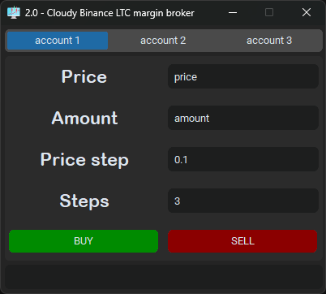

# Cloudy Binance LTC margin isolated broker

<p align="center">
  
</p>

This is a tool for traders to quickly scatter multiple orders at different price steps with just one mouse-click when either buying or selling. Splitting orders to smaller sub-orders at different prices will help traders to get orders filled at the best price without compromises as it is very hard to tell the exact turning points (resistant and peak) of any asset. 

For instance, if a trader just place a single order at a speculative resistance of $76, the order may barely be filled even if the difference between the actual resistance (for example $76.1) is marginable, therefore missing the good opportunity to buy. If instead the trader placed multiple smaller orders in a ladder manner e.g. 33% of the total amount at 76.2, 33% of the total amount at $76.1 and 33% of the total amount at $76, at least some of the orders will be filled at roughly the desired price, therefore the trader will not miss the opportunity entirely. 

However, placing multiple orders can be time-consuming, therefore this tool is created to help traders place multiple orders with just one click after setting the parameters once.

Currently, the tool only support the pair LTCUSDT in isolated margin as this pair seems to be one of the best to apply this ladder-like order placing strategy.

# Dependencies
This project depends on the following libraries:

packaging  
tkinter  
customtkinter  
binance-connector  
pyinstaller

# Configure and build
To use the program, you can either run the program from gui.pyw using python client or build it into a portable executable (.EXE). The author advises the later, please follow the instructions below. Either ways, you will need to configure the config.ini file first as follow.

## 1. Configuring the config.ini file
- Rename the file *config_example.ini* to *config.ini*.
- Go into you Binance account > API management > create new > edit > enable fixed IP verification (Google search *Whatsmyip*, it will return your public IP address which you can use to fill into Binance) > enable spot and margin trading.
- Copy the API key and API secret into their corresponding fields in the *config.ini* file (You better save these somewhere safe as Binance will only show it to you once, if you lose it, you have to create it again).
- Optionally, you can add multiple accounts (if needed) following the instructions in the *config_example.ini* file.

## 2. Build the application
Use the following commands to build the application once you have setup the config.ini file. Run it using the terminal from the repo's root directory:  
```
$ pip install pyinstaller
$ pyinstaller -i src/resource/assets/icon.ico -n "Cloudy LTC isolated Broker" --onefile --noupx --clean --add-data "src/main/config.ini:." --add-data "src/resource/assets/icon.ico:." src/main/gui.pyw
```

# Main class
gui.pyw

# Known issues
Antivirus like Window defender may flag the progam as malware and remove it.  
Solution: exclude it from being scanned by the Antivirus software.  
The dev is looking into this issue.

# Disclaimer
The program is delivered as is and does not include any warranty. The creator is not liable for any harm or loss causes by the program.